<div align="center">
  

  # NuMonitor for Serial Port

  **專業的 Web Serial Port 監控與數據視覺化工具**

  [](https://github.com/Nuxtack-tw/NuMonitor4SerialPort/releases)
  [](LICENSE)
  [](#瀏覽器支援)
  [](#多語言支援)

  [**線上執行**](https://nuxtack-tw.github.io/NuMonitor4SerialPort/) · [**English**](https://nuxtack.github.io/NuMonitor4SerialPort/) · [使用說明書](doc/manual.html) · [版本記錄](doc/changelog.html) · [回報問題](https://github.com/Nuxtack-tw/NuMonitor4SerialPort/issues)

</div>

---

## 📖 簡介

NuMonitor 是一款專為 **Arduino/ESP32** 開發者設計的 Serial Port 監控工具，旨在取代 Arduino IDE 的 Serial Monitor，提供更強大的功能和更好的使用體驗。

### ✨ 主要特色

- 🖥️ **終端機監控** - 即時顯示串口數據，支援時間戳記、自動捲動、URL 自動識別、TXT/HEX 切換、指令歷史
- 📊 **7 種圖表類型** - 折線圖、面積圖、柱狀圖、散點圖、圓餅圖、儀表圖、堆疊圖
- 🗺️ **GPS 軌跡追蹤** - 整合 OpenStreetMap，即時顯示 GPS 移動軌跡
- 🎯 **X 軸遊標** - 滑鼠移動即時顯示數據點數值
- 🚦 **RS-232 訊號狀態列** - BRK/RTS/DTR 可點擊切換，DCD/DSR/CTS/RI 即時顯示，含 ACT 與 ERR 指示
- 🔌 **智慧連線** - 記住上次的連接埠與鮑率，重新整理自動接回；裝置拔掉後無限重試直到插回
- 🌗 **深／淺雙主題** - GitHub 風格配色，設定自動記憶
- 🌐 **18 種語言** - 自動偵測瀏覽器語言，支援 RTL 語言
- 📦 **單一檔案** - 無需安裝，下載即可使用

---

## 🖼️ 截圖

<div align="center">
  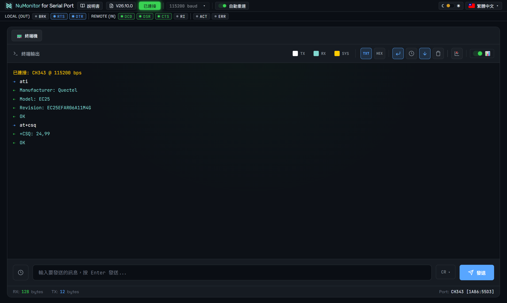
  <br><sub><b>終端機</b>：TX／RX 分色、時間戳記，圖為對數據機下 AT 指令</sub>
</div>

<div align="center">
  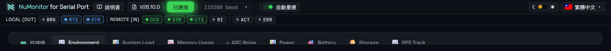
  <br><sub><b>RS-232 訊號狀態列</b>：RTS／DTR 可點擊切換，DCD／DSR／CTS 即時顯示</sub>
</div>

<div align="center">
  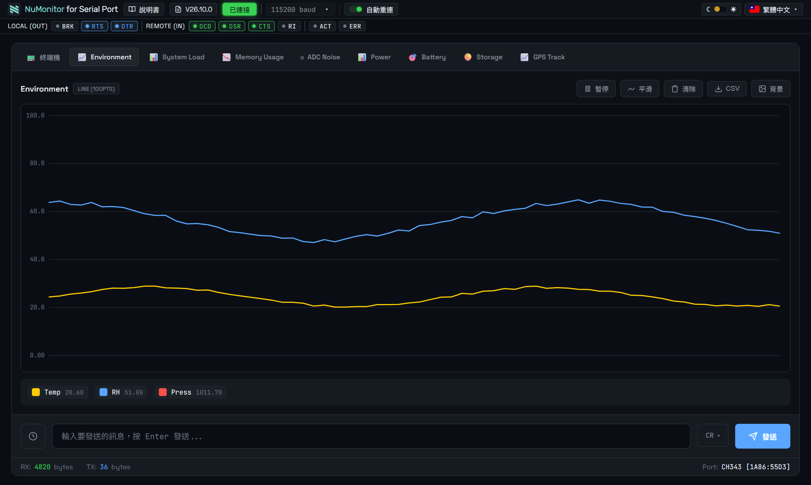
  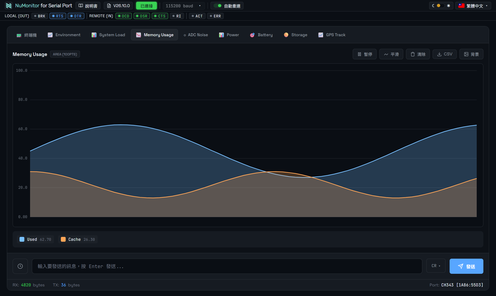
  <br><sub><b>折線圖 line</b>　／　<b>面積圖 area</b></sub>
</div>

<div align="center">
  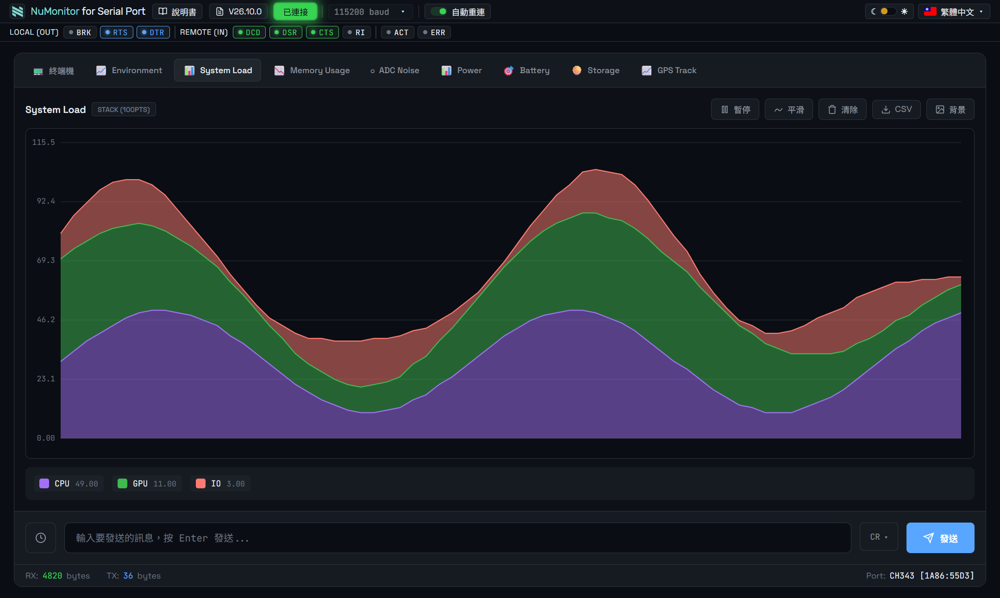
  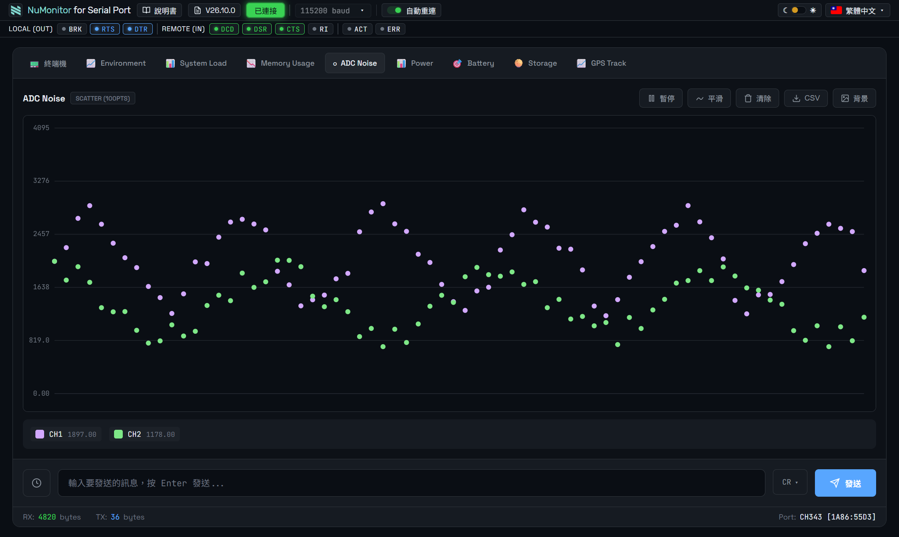
  <br><sub><b>堆疊面積圖 stack</b>　／　<b>散點圖 scatter</b></sub>
</div>

<div align="center">
  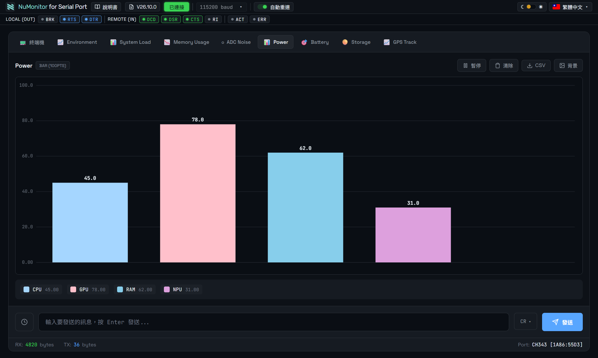
  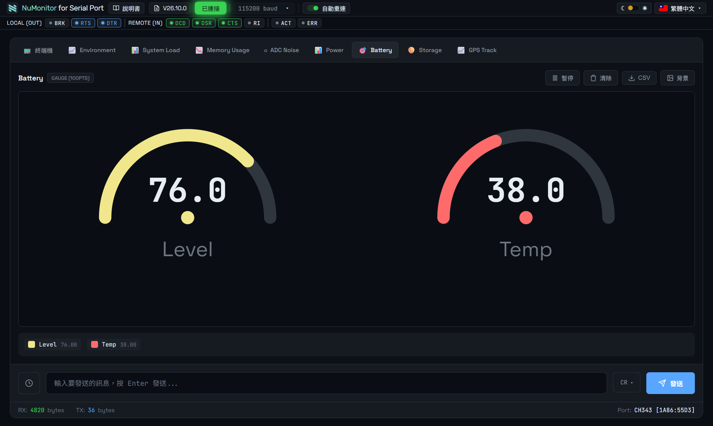
  <br><sub><b>長條圖 bar</b>　／　<b>儀表圖 gauge</b></sub>
</div>

<div align="center">
  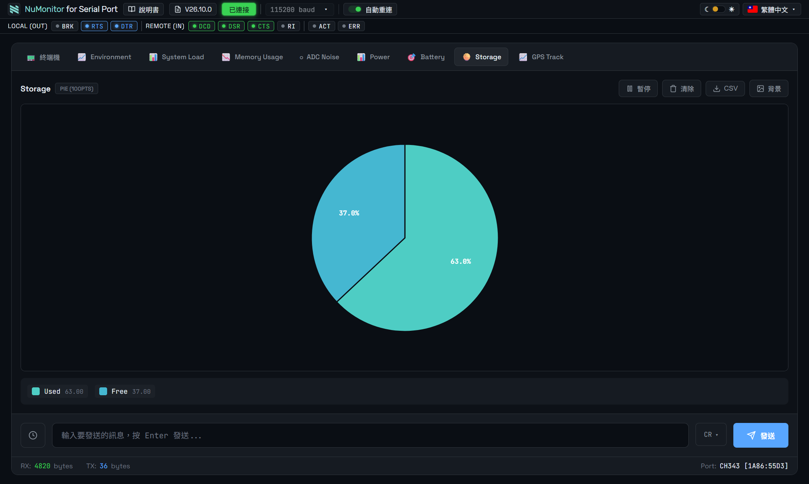
  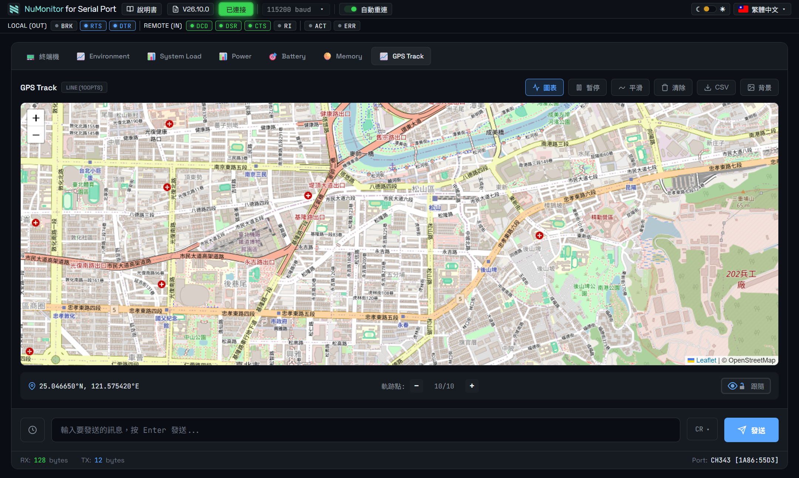
  <br><sub><b>圓餅圖 pie</b>　／　<b>GPS 軌跡地圖</b>（OpenStreetMap）</sub>
</div>

<div align="center">
  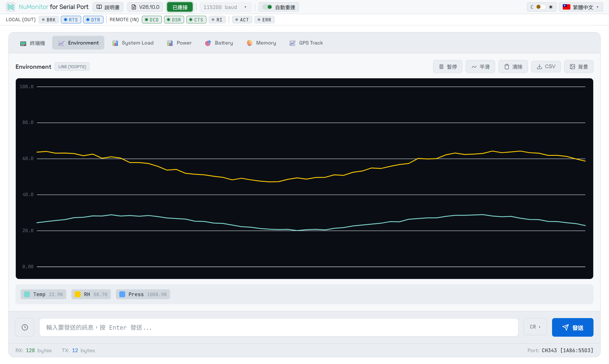
  <br><sub><b>淺色主題</b>：圖表格線、文字與背景全部跟著切換</sub>
</div>

> 更多畫面（HEX 模式、顏色選擇器、連接埠選單、語言選單）見[使用說明書](doc/manual.html)。

---

## 🚀 快速開始

### 1. 直接線上執行（免下載）

👉 **<https://nuxtack-tw.github.io/NuMonitor4SerialPort/>**

用 Chrome、Edge 或 Opera 打開就能用，不必下載任何檔案。

> Web Serial API 只在 **HTTPS 或 localhost** 下可用，GitHub Pages 是 HTTPS 所以沒問題。
> 注意：連接埠授權是**按網站來源記錄**的，線上版與本機版各自獨立，第一次使用要各自授權一次。

### 2. 或下載到本機使用

```bash
git clone https://github.com/Nuxtack-tw/NuMonitor4SerialPort.git
```

或直接下載 [最新版本](https://github.com/Nuxtack-tw/NuMonitor4SerialPort/releases/latest)，用 Chrome、Edge 或 Opera 開啟 `NuMonitor4SerialPort.html`。

> 直接用 `file://` 開啟也能用 Web Serial（本機檔案視為安全來源）。

### 3. 連接裝置

1. 將 Arduino/ESP32 透過 USB 連接到電腦
2. 點擊「連線」按鈕（第一次會跳出瀏覽器的連接埠對話框，之後直接連上次那顆）
3. 要換埠就點按鈕右側的 `▾`，從清單挑選，或選「其他…（瀏覽器選單）」授權新裝置
4. 開始監控！連上後按鈕會變成綠色的「已連接」、外框緩慢呼吸發光，滑鼠移上去轉紅顯示「斷開」

> 💡 **送指令沒反應？** 先確認輸入框右側的**行結尾**設定：Arduino/ESP32 多半用 `LF`，**數據機的 AT 指令必須用 `CR`**。此設定會被記住。
> 接數據機時通常還要把訊號列的 **DTR** 點亮（必要時連 RTS），詳見[使用說明書](doc/manual.html)。

---

## 📊 數據格式

### 基本格式

```cpp
// 自動命名 (CH1, CH2, CH3)
Serial.println("25.5 60.2 1013.2");

// Key:Value 格式
Serial.println("Temp:25.5 Humidity:60.2 Pressure:1013.2");
```

### 完整格式

```cpp
// {群組名稱|Y軸最小值|Y軸最大值|圖表類型}#計數器 Key1:Value1 Key2:Value2 map:緯度,經度
Serial.println("{Environment|0|100|line}#1 Temp:25.5°C RH:60.2%");
```

### 圖表類型

| 類型 | 代碼 | 說明 |
|------|------|------|
| 折線圖 | `line` | 連續數據變化 |
| 面積圖 | `area` | 強調數量變化 |
| 堆疊圖 | `stack` | 顯示組成比例 |
| 柱狀圖 | `bar` | 類別比較 |
| 散點圖 | `scatter` | XY 座標分布 |
| 圓餅圖 | `pie` | 比例分配 |
| 儀表圖 | `gauge` | 單一數值監控 |

### GPS 軌跡

```cpp
// 在數據後加上 map:緯度,經度
Serial.print("{GPS|0|100|line}Speed:40.5km/h map:");
Serial.print(lat, 6);
Serial.print(",");
Serial.println(lng, 6);
```

---

## 🌐 多語言支援

> 指的是**程式介面**的語言，開啟後可在右上角切換，設定會自動記住。

| 語言 | 代碼 | 語言 | 代碼 |
|------|------|------|------|
| 繁體中文 | zh-TW | Türkçe | tr-TR |
| English | en-US | العربية | ar-SA |
| 日本語 | ja-JP | עברית | he-IL |
| Français | fr-FR | فارسی | fa-IR |
| Deutsch | de-DE | Русский | ru-RU |
| Italiano | it-IT | हिन्दी | hi-IN |
| Español | es-ES | Tiếng Việt | vi-VN |
| Português | pt-PT | ไทย | th-TH |
| Bahasa Melayu | ms-MY | Bahasa Indonesia | id-ID |

---

## 💻 瀏覽器支援

| 瀏覽器 | 版本 | 狀態 |
|--------|------|------|
| Google Chrome | 89+ | ✅ 推薦 |
| Microsoft Edge | 89+ | ✅ 支援 |
| Opera | 75+ | ✅ 支援 |
| Firefox | - | ❌ 不支援 |
| Safari | - | ❌ 不支援 |

> ⚠️ NuMonitor 使用 Web Serial API，此 API 僅在 Chromium 核心的瀏覽器上支援。

---

## 📁 專案結構

```
NuMonitor4SerialPort/
├── NuMonitor4SerialPort.html    # 主程式（單一檔案應用，版號寫在 <title>）
├── backup/                      # 各版本凍結快照（NuMonitor4SerialPort_V<版號>.html）
├── doc/
│   ├── manual.html              # 使用說明書
│   └── changelog.html           # 版本記錄（唯一一份 changelog）
├── reports/                     # 分析報告（專案盤點、設計說明）
├── .claude/                     # Claude Code 開發設定
│   ├── skills/                  # 技能檔
│   └── sessions/                # Session 對話記錄
├── CLAUDE.md                    # Claude Code 專案指示
├── MEMORY.md                    # 專案記憶檔
├── TODO.md                      # 待辦事項
├── LICENSE
└── README.md
```

---

## 🔧 開發

### 技術棧

- **前端**: 純 HTML5 + CSS3 + JavaScript (ES6+)
- **API**: Web Serial API
- **地圖**: Leaflet.js + OpenStreetMap
- **架構**: 單一檔案應用程式 (SFA)

### 本地開發

由於使用 Web Serial API，需要透過本地伺服器或 `file://` 協議開啟：

```bash
# 使用 Python 啟動本地伺服器
python -m http.server 8080

# 或使用 Node.js
npx serve
```

---

## 📝 版本歷史

> **版本編號制度**：自 V26.0.0 起改用年度制 `Va.b.c`（`a` = 西元年後兩碼、`b` = 功能擴充、`c` = bug 修正）。版號的唯一來源是主程式 `<title>`。
> **完整變更記錄請看 [doc/changelog.html](doc/changelog.html)** —— 這裡只列各版重點。

### V26.10.1 (2026-07-31)

**修正**
- 🔗 說明書／版本記錄連結會跟著介面語言走（切成英文後會開英文版文件）

### V26.10.0 (2026-07-31)
- 💾 行結尾設定（無行尾／LF／CR／CRLF）記憶到 localStorage，重新整理後自動還原

### V26.8.0 ~ V26.9.1 (2026-07-31)
- 🚦 新增 RS-232 訊號狀態列：LOCAL(OUT) BRK/RTS/DTR 可點擊切換、REMOTE(IN) DCD/DSR/CTS/RI 唯讀、ACT 資料進出閃爍、ERR 協定錯誤告警
- 🔁 讀取遇到 Framing/Parity/Overrun/Break 錯誤時不再中斷連線，自動恢復接收
- 未連線時整列隱藏；燈號配色與標題列按鈕一致

### V26.6.0 ~ V26.7.1 (2026-07-31)
- 🔄 重新整理／重新開啟頁面時自動接回上次的連接埠（含還原鮑率）；自己按過「斷開」則不會自動接回
- 💾 「自動重連」開關狀態記憶
- ↔️ 主題切換與語言選單靠齊標題列右緣；移除寫死的換行斷點，改為真的擠不下才換行

### V26.1.0 ~ V26.5.1 (2026-07-30 ~ 07-31)
- 🔌 「選擇連接埠」與「斷開」合併為單一分割按鈕，連線狀態直接以按鈕顏色與呼吸光暈呈現
- 🧠 連線優先序：上次的埠 → 認得型號的埠 → 唯一已授權埠 → 才叫瀏覽器選單
- 📏 標題列全面重整：統一字級／字重／高度／配色，總高減少 45%

### V26.0.0 (2026-07-30)
- 🔢 版本編號改用年度制，`<title>` 成為版號唯一來源
- 🗄️ 新增 `backup/` 快照機制

### v3.0.x (2026-03)
- 🌗 新增淺色主題與即時切換
- 🔄 自動重連等待時間改為無限制

### v2.0.0 (2026-01)
- 🗺️ GPS 地圖軌跡追蹤、X 軸遊標、堆疊面積圖、終端機 URL 自動識別

查看完整 [版本記錄](doc/changelog.html)

---

## 🤝 貢獻

歡迎提交 Pull Request 或回報問題！

1. Fork 本專案
2. 建立特性分支 (`git checkout -b feature/AmazingFeature`)
3. 提交變更 (`git commit -m 'Add some AmazingFeature'`)
4. 推送到分支 (`git push origin feature/AmazingFeature`)
5. 開啟 Pull Request

---

## 📄 授權

本專案採用 MIT 授權 - 詳見 [LICENSE](LICENSE) 檔案

---

## 🙏 致謝

- [Leaflet.js](https://leafletjs.com/) - 地圖函式庫
- [OpenStreetMap](https://www.openstreetmap.org/) - 地圖圖資
- [JetBrains Mono](https://www.jetbrains.com/lp/mono/) - 等寬字體

---

<div align="center">

  **Made with ❤️ by [Nuxtack](https://github.com/Nuxtack)**

  ⭐ 如果這個專案對您有幫助，請給我們一顆星！

</div>
